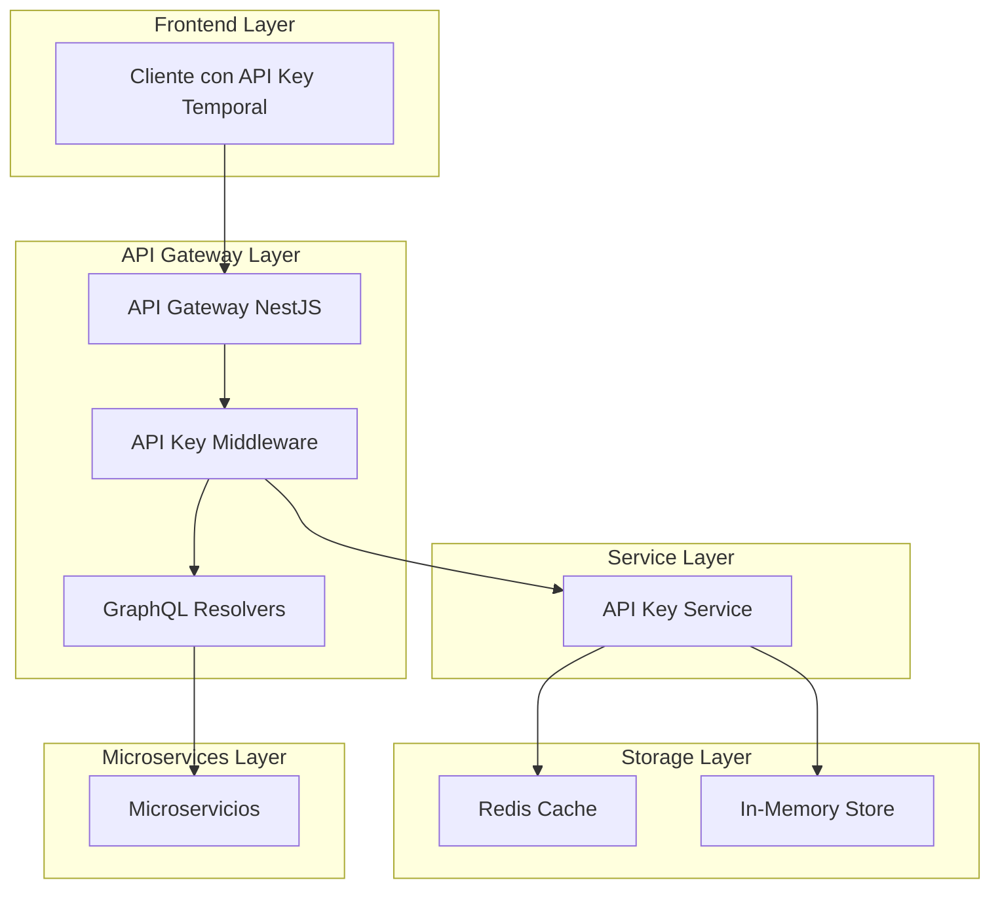
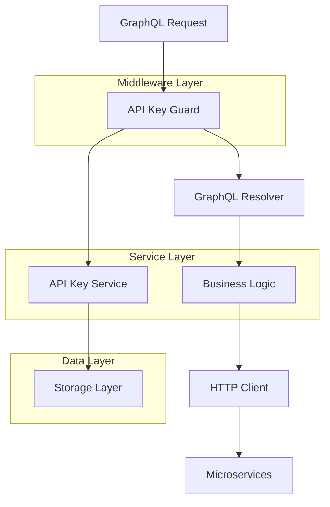
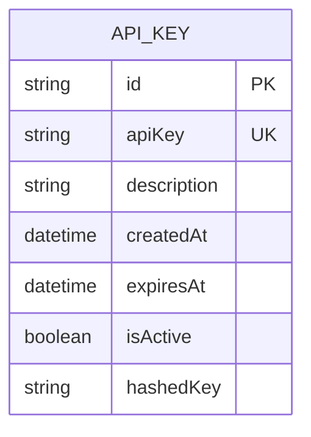

## 1. Architecture design



## 2. Technology Description

* Frontend: N/A (API-first)

* Backend: NestJS\@10 + GraphQL + Redis (opcional)

* Storage: Redis para persistencia o In-Memory para desarrollo

* Security: JWT + API Key temporal validation

## 3. Route definitions

| Route                | Purpose                                              |
| -------------------- | ---------------------------------------------------- |
| POST /graphql        | Endpoint principal GraphQL con validación de API Key |
| GET /api-keys/health | Health check del servicio de API Keys                |

## 4. API definitions

### 4.1 Core API

**Generación de API Key Temporal**

```graphql
mutation GenerateApiKey($input: GenerateApiKeyInput!) {
  generateApiKey(input: $input) {
    apiKey
    expiresAt
    expiresIn
    message
  }
}
```

Request:

| Param Name  | Param Type | isRequired | Description                                      |
| ----------- | ---------- | ---------- | ------------------------------------------------ |
| duration    | string     | true       | Duración de la API Key: "1h", "24h", "7d", "30d" |
| description | string     | false      | Descripción opcional para identificar la clave   |

Response:

| Param Name | Param Type | Description                  |
| ---------- | ---------- | ---------------------------- |
| apiKey     | string     | La API Key temporal generada |
| expiresAt  | string     | Timestamp ISO de expiración  |
| expiresIn  | number     | Segundos hasta expiración    |
| message    | string     | Mensaje de confirmación      |

Example:

```json
{
  "duration": "24h",
  "description": "API Key para aplicación móvil"
}
```

**Validación de API Key (Query)**

```graphql
query ValidateApiKey($apiKey: String!) {
  validateApiKey(apiKey: $apiKey) {
    valid
    expiresAt
    remainingTime
  }
}
```

**Gestión de API Keys**

```graphql
query ListApiKeys {
  listApiKeys {
    id
    apiKey
    description
    createdAt
    expiresAt
    isActive
  }
}

mutation RevokeApiKey($apiKey: String!) {
  revokeApiKey(apiKey: $apiKey) {
    success
    message
  }
}
```

## 5. Server architecture diagram



## 6. Data model

### 6.1 Data model definition



### 6.2 Data Definition Language

**Estructura de datos en Redis/Memory:**

```typescript
interface ApiKeyData {
  id: string;
  apiKey: string; // Hash de la clave real
  description?: string;
  createdAt: Date;
  expiresAt: Date;
  isActive: boolean;
}

// Estructura en Redis
// Key: `api_key:${hashedApiKey}`
// Value: JSON.stringify(ApiKeyData)

// Índice por expiración
// Key: `api_key_expiry:${timestamp}`
// Value: Set de API Keys que expiran en ese timestamp
```

**Configuración de Redis (opcional):**

```bash
# Variables de entorno adicionales
REDIS_URL=redis://localhost:6379
API_KEY_PREFIX=banking_gateway
API_KEY_DEFAULT_DURATION=24h
API_KEY_MAX_DURATION=30d
```

**Implementación In-Memory para desarrollo:**

```typescript
// Map para almacenar API Keys activas
private readonly apiKeys = new Map<string, ApiKeyData>();

// Set para cleanup automático de keys expiradas
private readonly expirationTimers = new Map<string, NodeJS.Timeout>();
```

**Middleware de validación:**

```typescript
@Injectable()
export class ApiKeyGuard implements CanActivate {
  async canActivate(context: ExecutionContext): Promise<boolean> {
    const request = context.switchToHttp().getRequest();
    const apiKey = request.headers['x-api-key'];
    
    if (!apiKey) {
      throw new UnauthorizedException('API Key requerida');
    }
    
    const isValid = await this.apiKeyService.validateApiKey(apiKey);
    if (!isValid) {
      throw new UnauthorizedException('API Key inválida o expirada');
    }
    
    return true;
  }
}
```

