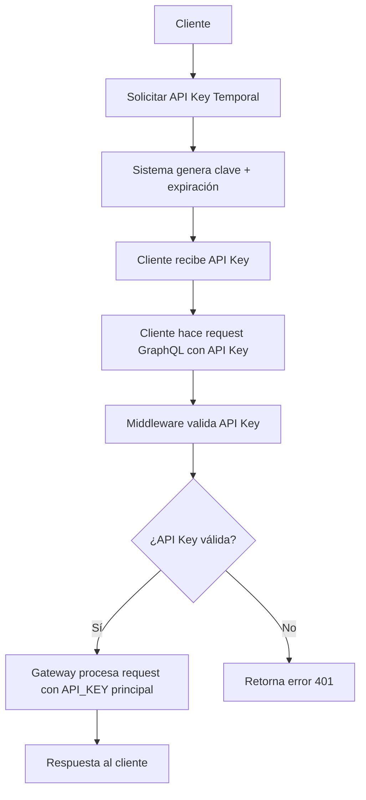

## 1. Product Overview
Sistema de API Keys Temporales para API Gateway GraphQL que permite a los clientes autenticarse con claves temporales generadas dinámicamente, mientras que internamente el gateway utiliza la API_KEY principal para comunicarse con los microservicios.

Este sistema mejora la seguridad al no exponer la API_KEY principal a los clientes externos y permite un control granular del acceso al API Gateway.

## 2. Core Features

### 2.1 User Roles
| Role | Registration Method | Core Permissions |
|------|---------------------|------------------|
| Cliente Externo | Solicitud de API Key temporal | Puede acceder al API Gateway con API Key temporal válida |
| Administrador | Acceso directo al sistema | Puede generar, revocar y gestionar API Keys temporales |

### 2.2 Feature Module
Nuestro sistema de API Keys temporales consiste en las siguientes funcionalidades principales:
1. **Generación de API Keys**: creación de claves temporales con expiración configurable.
2. **Validación de API Keys**: verificación de claves temporales en cada request al gateway.
3. **Gestión de API Keys**: listado, revocación y renovación de claves existentes.
4. **Middleware de Seguridad**: interceptor que valida API Keys antes de procesar requests GraphQL.

### 2.3 Page Details
| Page Name | Module Name | Feature description |
|-----------|-------------|---------------------|
| API Key Management | Generación de Keys | Generar nueva API Key temporal con duración configurable (1h, 24h, 7d, 30d). Retorna la clave y fecha de expiración |
| API Key Management | Validación de Keys | Validar API Key temporal en cada request. Verificar que no esté expirada ni revocada |
| API Key Management | Gestión de Keys | Listar API Keys activas, revocar claves específicas, renovar claves próximas a expirar |
| Security Middleware | Interceptor de Requests | Interceptar todos los requests GraphQL, extraer API Key del header, validar antes de procesar |

## 3. Core Process
**Flujo Principal de Autenticación:**
1. Cliente solicita una API Key temporal al endpoint de generación
2. Sistema genera una clave única con timestamp de expiración
3. Cliente incluye la API Key en el header `x-api-key` en sus requests GraphQL
4. Middleware intercepta el request y valida la API Key temporal
5. Si es válida, el gateway procesa el request usando la API_KEY principal para comunicarse con microservicios
6. Si es inválida o expirada, retorna error de autenticación

**Flujo de Gestión de Keys:**
1. Administrador puede listar todas las API Keys activas
2. Puede revocar claves específicas antes de su expiración
3. Puede renovar claves próximas a expirar

## 4. User Interface Design
### 4.1 Design Style
- **Colores primarios**: #2563eb (azul), #dc2626 (rojo para errores)
- **Colores secundarios**: #64748b (gris), #10b981 (verde para éxito)
- **Estilo de botones**: Redondeados con sombra sutil
- **Fuente**: Inter, tamaño base 14px
- **Layout**: Diseño limpio tipo dashboard con cards
- **Iconos**: Lucide icons para consistencia

### 4.2 Page Design Overview
| Page Name | Module Name | UI Elements |
|-----------|-------------|-------------|
| API Key Management | Generación | Card con formulario simple: selector de duración, botón "Generar". Resultado en card separado con clave generada y botón copiar |
| API Key Management | Lista de Keys | Tabla con columnas: ID, Clave (parcial), Fecha creación, Expiración, Estado, Acciones (Revocar/Renovar) |
| Security Middleware | N/A | No tiene UI - es funcionalidad backend |

### 4.3 Responsiveness
El sistema está diseñado como API-first, por lo que la UI es opcional y se enfoca en funcionalidad administrativa. Si se implementa UI, será responsive con diseño mobile-first.